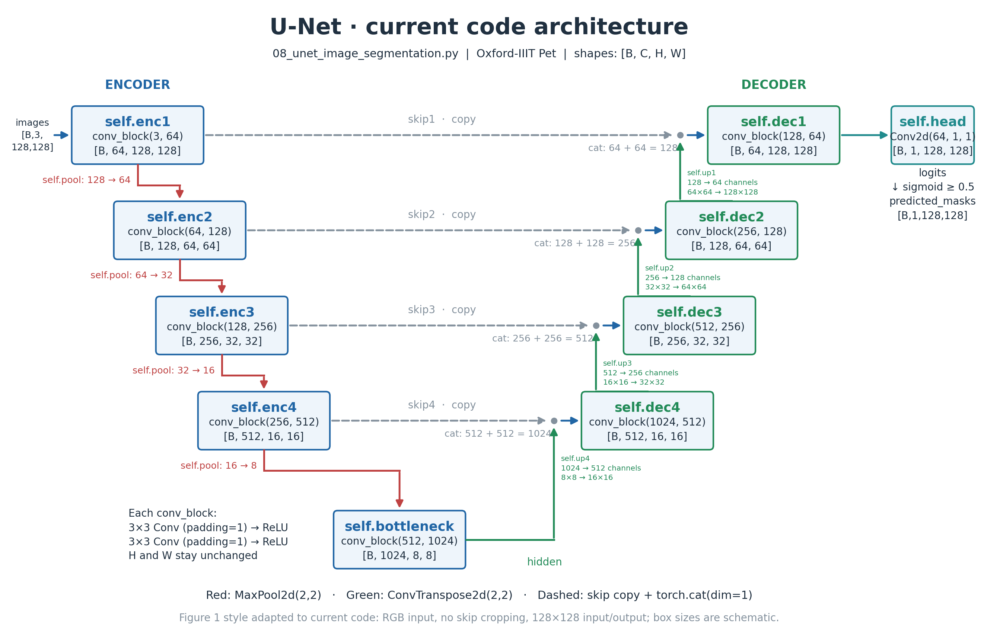

# U-Net 学习笔记：数据预处理、上采样与梯度

对应代码：[08_unet_image_segmentation.py](../08_unet_image_segmentation.py)  
结构图：[UNet_Current_Code_Structure.png](UNet_Current_Code_Structure.png)

这份笔记按最初的 7 个问题编号组织，并合并后续追问。当前任务是 Oxford-IIIT Pet 的前景/背景二分类分割；输入为 RGB 图片，尺寸为 128×128。



## 1. OxfordIIITPet 的 trainval 和 test

`split` 选择官方事先划分好的样本列表，不是在每次调用时重新随机划分。

| split | 用途 | 当前代码中的处理 |
|---|---|---|
| trainval | 训练和验证的数据池 | 再用 random_split 划分训练集和验证集 |
| test | 最终测试 | 不参与参数训练和模型选择 |

```python
full_train = PetSegmentationDataset("trainval")
train_size = len(full_train) - 500
train_set, val_set = random_split(
    full_train, [train_size, 500],
    generator=torch.Generator().manual_seed(SEED),
)
test_set = PetSegmentationDataset("test")
```

- 从 trainval 中随机留出 500 张用于验证。
- 固定 SEED，使这次训练/验证划分可以复现。
- 训练集用于更新参数，验证集用于比较模型；代码按最小 val_loss 保存 checkpoint。
- 最后加载最佳 checkpoint，再在 test 上评估。
- 只有训练 loader 设置 shuffle=True；shuffle 改变遍历顺序，不改变集合成员。

`build_dataloaders()` 把数据集创建、划分和批次加载集中到一个函数中，返回 train_loader、val_loader 和 test_loader。

## 2. cast(Image.Image, image) 的作用

```python
image = cast(Image.Image, image)
mask = cast(Image.Image, mask)
```

这里的 cast 来自 typing，它用于告诉编辑器或静态类型检查工具：“按 PIL.Image.Image 类型理解这个对象”。

**它不转换对象，不复制图片，也不检查实际类型。运行时返回的仍然是原对象。**

当前数据集返回的图片和分割 mask 本身就是 PIL 图片，因此 cast 不是 OxfordIIITPet 必须的步骤。删掉这些 cast，当前数据处理仍能运行，但编辑器可能少一些类型提示。

不要将 typing.cast 与以下操作混淆：

```python
image.convert("L")       # 真正转换成灰度图片
to_tensor(image)         # 真正转换成 Tensor
mask_tensor.float()      # 真正转换 Tensor 的数据类型
```

## 3. resize 的尺寸为什么写成元组

```python
output_size = (IMAGE_SIZE, IMAGE_SIZE)
image = image.resize(output_size)
```

PIL 的 resize 接收两个尺寸组成的序列，通常使用元组。**顺序是 (width, height)，不是 (height, width)。**

```python
image.resize((128, 64))  # 宽128，高64
```

而 Tensor 通常按 [C, H, W] 排列。因此，上面的 RGB 图片转换成 Tensor 后，shape 是 [3, 64, 128]。

当前使用正方形 (128, 128)，所以容易忽略宽高顺序。

## 4. BILINEAR 与 NEAREST：缩放时怎样计算新像素

```python
image = image.resize(output_size, Image.Resampling.BILINEAR)
mask = mask.resize(output_size, Image.Resampling.NEAREST)
```

resize 创建新的像素网格，resample 指定怎样从原图计算新网格的像素值。

| 方法 | 处理方式 | 当前用途 |
|---|---|---|
| BILINEAR（双线性插值） | 利用附近像素加权计算 | 原图的颜色强度 |
| NEAREST（最近邻） | 采用最近的原像素值 | mask 的类别编号 |

### 追问：是否就是补充缺失值？

放大时，可以理解为补出新增位置的像素。但更准确的说法是：**重新采样，计算新网格每个位置的值。**

缩小时也要计算新像素，所以不是专门处理数据缺失。双线性缩小的具体实现还会考虑过滤邻域，不能一概理解成任何情况下都只读取固定四个像素。

### 为什么 mask 不能与原图使用相同的插值？

颜色可以加权混合，类别编号不能这样混合。

例如，标签1是宠物，标签3是边界；若平均得到2，恰好会被解释为背景。即使结果最后仍是整数，也可能产生错误类别。

最近邻只采用已有的标签值，避免把类别编号当连续数值进行插值。

两者调整到相同宽高，保证图片像素和标签位置保持对应。直接缩放成正方形可能改变长宽比，但不会破坏这对图片和 mask 的对应关系。

## 5. pil_to_tensor、to_tensor 与 mask 二值化

### 5.1 原图也转换成了 Tensor

```python
image = to_tensor(image)
```

不是把 PIL 图片直接送进 U-Net。当前模型和 loss 使用 PyTorch Tensor，因此原图和 mask 都要转换。

### 5.2 两个转换方法的区别

对于当前普通的8位图片：

| 方法 | 数值处理 | 输出类型 | 维度排列 |
|---|---|---|---|
| to_tensor | 除以255，0～255变成0～1 | 浮点 Tensor | [C,H,W] |
| pil_to_tensor | 保留原数值，不进行0～1缩放 | 保留对应整数类型 | [C,H,W] |

这里讨论的是当前图片类型；其他 PIL 模式或输入类型不能一律套用“to_tensor 必定除以255”。

原图像素代表颜色强度，使用 to_tensor 将其缩放到0～1。mask 像素代表类别编号，需要保留1、2、3才能判断背景标签2。

### 5.3 拆开理解这行代码

```python
mask = (pil_to_tensor(mask) != 2).float()
```

等价于：

```python
mask_tensor = pil_to_tensor(mask)  # [1,128,128]，保留1、2、3
foreground = mask_tensor != 2     # [1,128,128]，布尔类型
mask = foreground.float()        # [1,128,128]，浮点0.0或1.0
```

| 原标签 | 原含义 | != 2 的结果 | float 后 |
|---|---|---|---|
| 1 | 宠物 | True | 1.0 |
| 2 | 背景 | False | 0.0 |
| 3 | 边界 | True | 1.0 |

**!= 2 是逐像素判断，不是限制函数返回值不能为2。** 当前代码主动将宠物和边界合并为前景。

### 5.4 为什么需要 float()

当前 loss 是 BCEWithLogitsLoss，它需要与模型输出兼容的浮点目标。这里0.0代表背景，1.0代表前景。

不要因此认为所有分类标签都必须 float：例如 CrossEntropyLoss 的类别索引目标通常使用 long，要求取决于 loss。

### 5.5 为什么不能直接对 mask 使用 to_tensor 后再 != 2

如果背景编号2经过除以255，会变成2/255。再比较 != 2，背景也会得到 True，导致全部像素被误当成前景。

所以当前顺序必须是：**保留类别值 → 判断前景 → 转浮点标签。**

DataLoader 组成批次后：

```text
images: [B,3,128,128]
masks:  [B,1,128,128]
```

## 6. Conv2d 与 ConvTranspose2d

两者都包含可学习的权重，但空间尺寸的计算方式不同。

| 模块 | 当前配置下的作用 | 示例 shape |
|---|---|---|
| Conv2d(3,64,3,padding=1) | 提取特征，保持长宽 | [B,3,128,128] → [B,64,128,128] |
| ConvTranspose2d(1024,512,2,stride=2) | 学习上采样，长宽翻倍 | [B,1024,8,8] → [B,512,16,16] |

### 追问：转置卷积就是为了上采样吗？

**在当前 U-Net 中，是的。** 但“翻倍”来自当前 kernel_size=2、stride=2 等配置，不是所有转置卷积都会自动翻倍。

它不是普通卷积的真正逆运算，也不能保证恢复下采样前的原图。它学习生成更高空间分辨率的特征图。

普通卷积也不一定保持尺寸；当前 conv_block 使用 kernel_size=3、stride=1、padding=1，才保持长宽不变。

### 当前解码端的一组操作

```python
upsampled4 = self.up4(hidden)  # [B,512,16,16]
concatenated4 = torch.cat([upsampled4, skip4], dim=1)  # [B,1024,16,16]
hidden = self.dec4(concatenated4)  # [B,512,16,16]
```

- up4：扩大空间尺寸，同时将通道从1024变成512。
- cat(dim=1)：沿通道维拼接，512+512=1024；长宽不变。
- dec4：将拼接特征融合，输出512通道。

当前 padding=1，因此 skip 与上采样结果的长宽匹配，不需要论文原版的中心裁剪。

## 7. sigmoid、阈值、detach 与 no_grad

### 7.1 从 logits 到二分类预测

```python
probabilities = logits.sigmoid()      # [B,1,128,128]，前景概率
predictions = probabilities >= 0.5    # [B,1,128,128]，True/False
predictions = predictions.long()      # [B,1,128,128]，整数1/0
```

logits 是未经过 sigmoid 的原始输出，可为正或负。sigmoid 将它映射为0～1。

long 将布尔预测变成 TorchMetrics 接收的整数标签。

训练时直接将 logits 传给 BCEWithLogitsLoss；它已经结合了 sigmoid 与二分类交叉熵，不需要先手动 sigmoid 再传入该 loss。

### 7.2 追问：没有传 loss，为什么还会有梯度记录？

**是否传入 loss，与是否记录计算图没有直接关系。**

训练时 logits 来自具有可训练参数的模型，连接着梯度计算图。在梯度记录开启时，继续计算 sigmoid，PyTorch 会记录这一步的计算关系，即使之后没有调用 backward。

需要分开理解：

1. 前向计算时记录计算图。
2. 调用 loss.backward() 时利用计算图计算梯度。
3. optimizer.step() 根据梯度更新参数。

“不调用 backward”不等于“前向时完全没有记录计算图”。

### 7.3 为什么 Dice 评估不需要梯度？

| 路径 | 目的 | 当前是否用于反向传播 |
|---|---|---|
| logits → loss | 给参数更新提供依据 | 是，调用 loss.backward() |
| logits → predictions → Dice | 衡量分割效果并打印 | 否 |

当前使用的硬阈值 Dice 只负责打分。另一些项目会使用可微分的 soft Dice loss 训练模型，那是不同的用途，不能在其训练路径上随意关闭梯度。

### 7.4 detach 是什么？必须吗？

detach 返回与原计算图断开的 Tensor，数值不变，且与原 Tensor 共享底层存储；它不是复制数据。

```python
predictions = (logits.detach().sigmoid() >= 0.5).long()
```

这样会让评分路径的 sigmoid 不再记录梯度关系，但不会断开原 logits 用于 loss 的那条路径。

**当前硬阈值评分中，detach 不是必需的。** 比较操作 >= 0.5 本身会产生不支持梯度反传的布尔结果。

### 7.5 直接写 logits.sigmoid() >= 0.5 是否错误？

不错误。作为评分预测，它可以正常运行。直接比较返回 bool；当前指标实现接着用 long 转成整数：

```python
predictions = (logits.sigmoid() >= 0.5).long()
```

不使用 detach 时，sigmoid 可能短暂记录不必要的梯度关系，但不会因此自动触发 backward，更不会自动更新参数。

### 7.6 @torch.no_grad() 必须吗？

也不是必需的。它明确让整个函数里的计算不记录梯度，避免不必要的计算图开销。

**笔记整理时，仓库代码保留了这个装饰器，并已去掉 detach：**

```python
@torch.no_grad()
def dice_score(logits, targets):
    predictions = (logits.sigmoid() >= 0.5).long()
    return binary_f1_score(
        preds=predictions,
        target=targets.long(),
        multidim_average="samplewise",
        zero_division=1,
    ).mean()
```

若为了初学时简洁去掉装饰器，上面的硬阈值 Dice 结果仍然相同。装饰器只在函数执行期间关闭梯度记录，不会关闭外部训练的 loss.backward()。

## 8. Dice score 与当前训练日志

二分类前景 Dice 与前景 F1 的数学形式相同：

```text
Dice = 2 × intersection / (predicted foreground + true foreground)
     = 2TP / (2TP + FP + FN)
```

范围为0～1，越高越好。当前 TorchMetrics 设置：

- samplewise：每张图独立评分。
- mean()：将这一批图片的分数取平均。
- zero_division=1：预测与标签都为空前景时记为1。
- run_epoch 按每批实际图片数加权，得到逐图平均的 epoch Dice。

| 日志字段 | 含义 | 期待方向 |
|---|---|---|
| train_loss | 训练集损失 | 降低 |
| train_dice | 训练集前景重叠分数 | 提升 |
| val_loss | 验证集损失 | 降低 |
| val_dice | 验证集前景重叠分数 | 提升 |

重点观察验证集表现，而不是仅看训练集。当前 checkpoint 按 val_loss 选择，未必正好对应 val_dice 最大的 epoch。

## 官方参考

- [OxfordIIITPet](https://docs.pytorch.org/vision/main/generated/torchvision.datasets.OxfordIIITPet.html)
- [typing.cast](https://docs.python.org/3/library/typing.html#typing.cast)
- [Pillow Image.resize](https://pillow.readthedocs.io/en/stable/reference/Image.html#PIL.Image.Image.resize)
- [pil_to_tensor](https://docs.pytorch.org/vision/main/generated/torchvision.transforms.functional.pil_to_tensor.html)
- [to_tensor](https://docs.pytorch.org/vision/main/generated/torchvision.transforms.functional.to_tensor.html)
- [ConvTranspose2d](https://docs.pytorch.org/docs/stable/generated/torch.nn.ConvTranspose2d.html)
- [Tensor.detach](https://docs.pytorch.org/docs/stable/generated/torch.Tensor.detach.html)
- [torch.no_grad](https://docs.pytorch.org/docs/stable/generated/torch.no_grad.html)
- [TorchMetrics binary F1](https://lightning.ai/docs/torchmetrics/v1.8.2/classification/f1_score.html)
